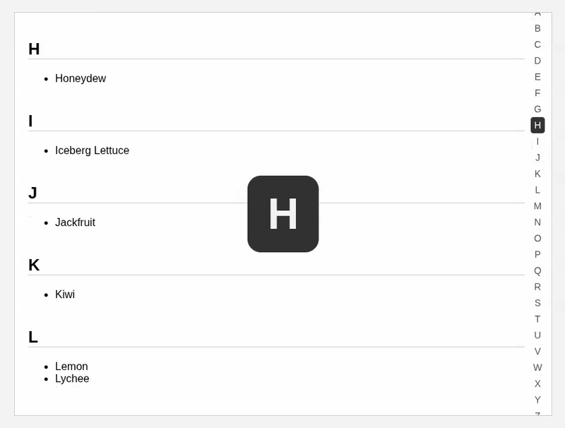

# 🔠 A responsive A–Z scrollbar UI component built with **HTML**, **CSS**, and **JavaScript** — inspired by the Android launcher. 

It allows users to:

- Navigate long lists using an **alphabet index**
- **Slide over letters** to scroll instantly to sections
- View a large overlay of the **active letter**
- Works on **mobile and desktop**
- Fully contained inside a scrollable `<section>`
- **No visible scrollbars**, just smooth scrolling

## 📸 Preview

## 🚀 Features

- Dead Simple
- Responsive layout (vertical A–Z on desktop, horizontal on mobile)
- Drag or touch across letters to scroll
- Enlarged overlay letter while sliding
- Scrollbar hidden (but scrollable)
- Pure HTML, CSS, and JS — no frameworks
